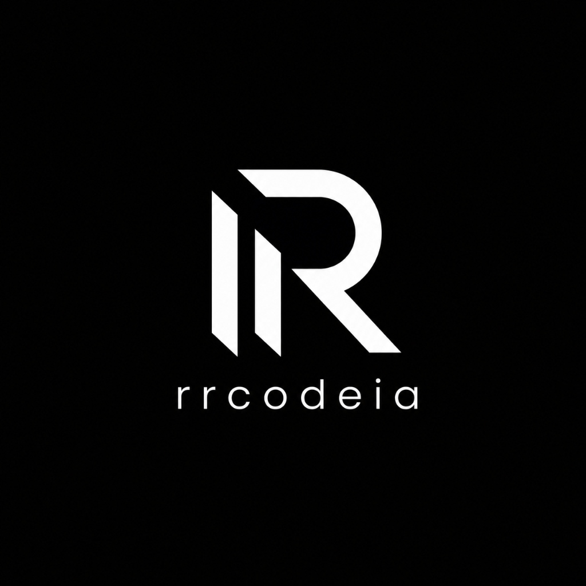

# O Playbook de Vendas: RrcodeOS
*O seu mapa oficial para transformar Inteligência Artificial em dinheiro no bolso com o comércio local.*

---

## Bem-vindo ao RrcodeOS
Se você está lendo isso, você acaba de adquirir uma agência completa "em uma caixa". O RrcodeOS tem 35 habilidades (skills) de elite, capazes de fazer o trabalho de estrategistas, designers e gestores de tráfego sêniores.

Mas, na rua, a regra de ouro é uma só:
> **O dono da padaria, o mecânico e o dentista não querem comprar "Inteligência Artificial". Eles querem comprar clientes na porta e o telefone tocando.**

Este playbook é o seu manual de sobrevivência. Ele traduz a força bruta do RrcodeOS em **4 Pacotes Prontos** que você pode oferecer hoje mesmo no comércio da sua cidade.

---

## 📦 Pacote 1: "O Telefone Tocando" (Busca Local)
**Ideal para:** Mecânicas, Desentupidoras, Chaveiros, Pizzarias, Clínicas.
**Preço sugerido:** R$ 500 a R$ 1.000 (Setup único)

* **O que você fala na rua:** 
  > "Notei que quando alguém pesquisa 'mecânico perto de mim' no Google, sua oficina não aparece no mapa, mas a do seu concorrente sim. Você está perdendo dinheiro todo dia. Eu posso configurar sua presença profissional no Google para você aparecer no topo e receber as ligações direto no seu WhatsApp."
* **O que você faz no RrcodeOS quando chegar em casa:** 
  Abra o chat e digite `/especialista-gmb`. A IA vai auditar a empresa, criar a descrição perfeita com SEO e te dar o passo a passo para otimizar o Google Meu Negócio do seu cliente. Para manter o cliente feliz, use a `/responder-avaliacoes` toda semana.

---

## 📦 Pacote 2: "A Sede Digital" (Criação de Sites e E-commerce)
**Ideal para:** Profissionais Liberais, Clínicas, Lojas que precisam vender online.
**Preço sugerido:** R$ 1.500 a R$ 3.000 (Setup único) + R$ 150 (Manutenção Mensal)

* **O que você fala na rua:**
  > "Hoje, se alguém procura pelo seu serviço e encontra só um Instagram bagunçado, ele não sente confiança e vai pro concorrente que tem um site profissional. Eu vou construir a sua base: um site rápido, seguro e focado em vendas, que funciona como o seu melhor vendedor 24 horas por dia."
* **O que você faz no RrcodeOS quando chegar em casa:**
  Digite `/site-expresso`. A IA vai te perguntar o tipo de site (E-commerce, Institucional, Landing Page ou Blog) e vai gerar todo o código focado em conversão. **O mais importante:** ela vai gerar um `MANUAL_DA_HOSPEDAGEM.md` que te ensina *tim tim por tim tim* como comprar o domínio no Registro.br, onde hospedar de graça (ou pago se for E-commerce), como ativar o cadeado de segurança (SSL) e, principalmente, como cobrar R$ 150/mês de manutenção do cliente para gerar renda passiva.

---

## 📦 Pacote 3: "A Máquina de Orçamentos" (Anúncios)
**Ideal para:** Corretores, Advogados, Prestadores de Serviço de Alto Valor.
**Preço sugerido:** R$ 1.000 a R$ 2.000+ (Mensal) + Orçamento dos anúncios

* **O que você fala na rua:**
  > "Se você tiver orçamento para investir, eu posso ligar uma máquina de anúncios hoje que vai colocar pessoas pedindo orçamento no seu WhatsApp amanhã. Eu cuido de toda a estrutura técnica."
* **O que você faz no RrcodeOS quando chegar em casa:**
  Digite `/diagnosticar` para a IA entender o negócio do cliente. Depois, rode a `/trafego-pago` e a `/anuncio-google`. O RrcodeOS criará toda a estratégia, os textos dos anúncios e até o arquivo técnico pronto para subir no Gerenciador de Anúncios sem que você precise ser um expert.

---

## 📦 Pacote 4: "O Atendente 24 Horas" (Automação com IA)
**Ideal para:** Barbearias, Clínicas, Odontologistas, Restaurantes e qualquer negócio que perca clientes porque demora a responder.
**Preço sugerido:** R$ 1.000 a R$ 2.000 (Setup) + R$ 300 (Manutenção Mensal)

* **O que você fala na rua:**
  > "O seu barbeiro está cortando cabelo ou respondendo cliente? Você está perdendo agendamentos porque as pessoas mandam mensagem às 22h e ninguém responde. Eu vou instalar um robô de Inteligência Artificial no seu WhatsApp que lê a sua agenda e marca o horário do cliente sozinho, de madrugada, domingos e feriados."
* **O que você faz no RrcodeOS quando chegar em casa:**
  Digite `/agente-whatsapp`. A IA vai gerar o "Cérebro" do robô (o prompt que você vai colar na ferramenta) e te dar o guia exato de como plugar isso na agenda do cliente sem precisar saber programar.

---

## 🤝 Como Fechar o Negócio (O Passo a Passo)

1. **Abordagem:** Ofereça um dos pacotes acima.
2. **Insegurança com Preço?** Digite `/precificar` no RrcodeOS e conte para a IA sobre o cliente. Ela calculará exatamente quanto você deve cobrar para ter lucro.
3. **Não sabe como mandar a proposta?** Digite `/proposta`. O RrcodeOS vai escrever um documento comercial extremamente persuasivo, pronto para você salvar em PDF e enviar no WhatsApp do dono do comércio.
4. **Fechou?** Digite `/novo-projeto` para abrir a pasta do cliente no seu sistema e comece a executar as skills do pacote vendido.

 

  <strong>Você tem a ferramenta mais poderosa do mercado nas mãos. Agora vá para a rua e faça acontecer.</strong> 
  <em>— Equipe rrcodeia</em>

